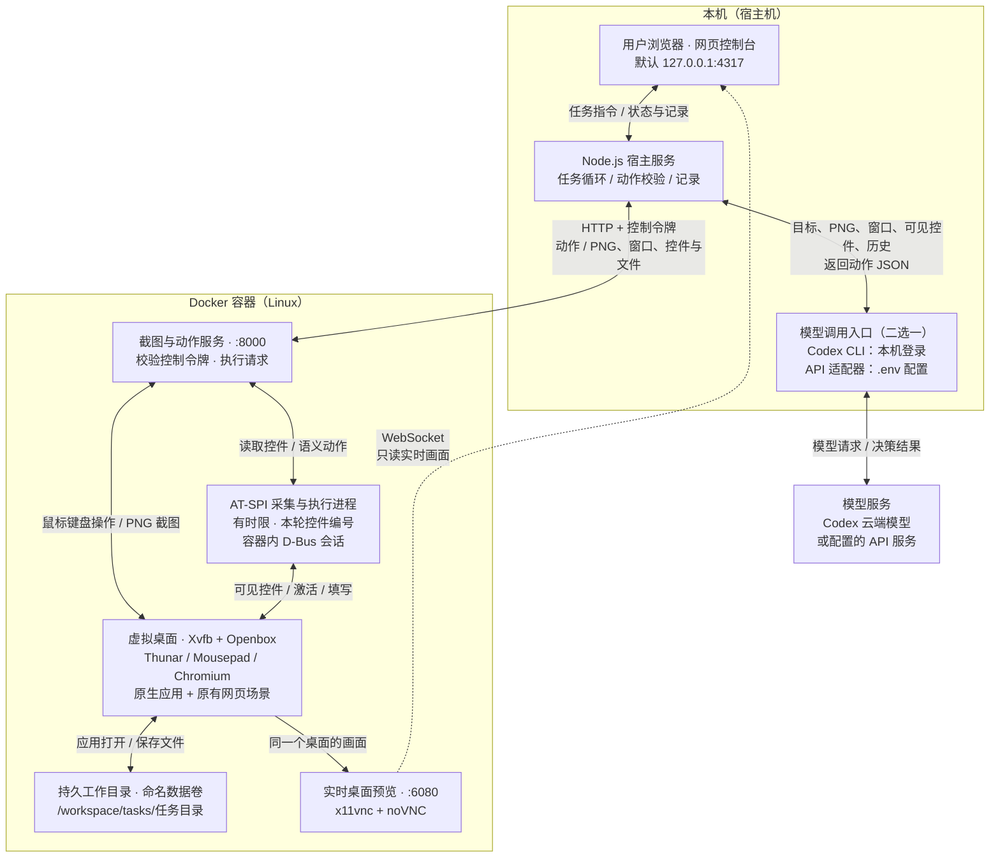

# Agent Lab · 桌面代理实验室

一个可以在本机启动的真实 AI Linux 桌面操作 demo：输入目标，观察模型读取截图、窗口与 Linux 无障碍控件，选择动作，再根据执行结果继续操作。支持容器内文件管理器、文本编辑器和浏览器的跨应用任务，也保留画板、迷宫与其他网页场景。控制台提供实时桌面、模型截图与观察记录，不控制宿主 Windows/macOS/Linux 桌面。

这是对“截图 + 可见控件 → 模型决策 → 受控执行 → 再观察”架构的独立演示，不是 Codex 官方电脑控制插件，也不代表其内部实现。

想先了解各部分怎么连接，可以直接看下面的[架构图](#架构图决策与执行如何连接)。

## 启动并打开控制台

启动器需要 Node.js 22 或更新版本、随附的 npm，以及带 Compose 支持的 Docker Desktop / Linux Docker 引擎。请先安装这些前置软件；Docker 需要使用 Linux 容器。让模型实际执行任务时，再任选已登录的 Codex CLI，或支持图片输入与 JSON 输出的 OpenAI / 兼容 API 服务。

Docker 必须连接本机引擎；启动器会拒绝远程 Docker context / `DOCKER_HOST`，因为控制台需要访问本机容器端口。

镜像由 `docker/Dockerfile` 本地构建，基础为 `debian:bookworm-slim`（Debian 12）。Chromium、Thunar、Mousepad、AT-SPI2、Python GI 和桌面工具来自该发行版的软件包源，未锁定补丁版本；不同日期重新构建可能得到不同补丁版本。宿主不需要单独安装 Linux 应用或无障碍依赖，也不需要额外开放端口。Dockerfile 仍复制整个 `public/labs/`，原有两个 HTML 实验页和无障碍测试页都会进入镜像。

Windows 可以直接双击 `start-demo.cmd`。在 Windows、macOS 或 Linux 的项目目录中，也可以运行：

```powershell
npm run launch
```

**无需先执行 `npm install`**。启动器会检查依赖，缺失时自动执行 `npm ci`；准备完成后，启动控制台并在默认浏览器打开 [http://127.0.0.1:4317](http://127.0.0.1:4317)。控制台端口可通过 `.env` 的 `PORT` 修改，容器的 `6080` 和 `8000` 端口保持固定。

启动流程如下：

1. 检查 Node.js 版本，识别同一项目目录中已经运行的控制台。若发现现有控制台，直接复用并打开，不再安装依赖、重建容器或重启服务。
2. 尚未运行时，使用启动锁防止重复启动，检查依赖，并准备 `.env` 和 `dockercompose.env`；已有配置文件均不覆盖。
3. 检查 Docker Compose 和 Linux 引擎。引擎未启动时，尝试执行 `docker desktop start`；当前环境不支持自动启动时，请先手动启动 Docker。
4. 执行 `docker compose up -d --build`，等待容器健康检查通过。首次构建需要下载浏览器等依赖。
5. 启动宿主控制台并打开默认浏览器。控制台显示当前模型来源、计费提示和桌面状态。

依赖安装、Docker 准备和健康等待等步骤均设置了超时。如果端口被其他程序占用，启动器只报告冲突，不会结束占用端口的进程。启动过程不修改 API key，也不通过付费请求测试真实 API 可用性。

需要手动打开网页，或查看启动参数时，可以运行：

```powershell
node scripts/start.mjs --no-open
node scripts/start.mjs --help
```

请保持实际运行控制台的启动终端打开。`Ctrl+C` 停止该控制台，不停止 Docker 容器；关闭容器需要单独执行 `npm run desktop:stop`。重复双击只会复用已运行的服务，不会让旧服务重新读取 `.env`。

### 首次填写配置或分步启动

如果希望首次启动前先填写 API 配置，可以先运行 `npm run setup`，编辑生成的 `.env`，再执行 `npm run launch`。`setup` 不需要预先安装项目依赖。

也可以使用分步命令：

```powershell
npm ci
npm run setup
# 如需 API 模式，在此时编辑生成的 .env，再继续启动。
npm run desktop
npm start
```

`npm run setup` 会生成本机 `.env`，并创建保存随机容器控制令牌的 `dockercompose.env`；已有文件均不覆盖。容器控制令牌用于宿主调用桌面服务，不是模型 API key。可提交到仓库的 `.env.example` 只包含配置模板，真实 `.env`、容器令牌和 `runs/` 产物不纳入版本控制。

## 配置模型来源

在项目根目录的 `.env` 中配置模型。默认 `MODEL_PROVIDER=auto`：**启动时优先检测并使用本机已登录的 Codex CLI，即使 `.env` 中填写了 API key**；没有检测到 Codex 登录时，才使用已配置的 API。也可以明确设置 `codex` 或 `openai`，这两种显式选择始终优先，不会改用另一种来源。这里的 `openai` 表示 API 连接方式，也可连接显式配置的兼容服务。

如果本机有可用的 Codex CLI，且它能访问运行 demo 的同一系统账号下的登录状态，保留 `auto`、直接一键启动即可，不需要再次登录或填写 API key。Windows 会尝试发现 Codex 桌面应用自带的 CLI，具体查找方式见下文。

服务会固定当前选中的模型来源。只有在任务空闲时点击“重新检测登录”，或重启控制台，才会重新检测并按上述规则选择；**任务运行中和模型请求失败时都不会自动切换来源**。重新检测只检查当前 CLI 登录并使用服务已加载的配置，不自动登录、不处理 token，也不重新读取 `.env`。修改 `.env` 仍需停止旧控制台后重启。

以下是完整配置示例，API key 留空，按你的选择填写：

```dotenv
MODEL_PROVIDER=auto
OPENAI_API_KEY=
OPENAI_BASE_URL=https://api.openai.com/v1
OPENAI_MODEL=gpt-4.1
OPENAI_API_STYLE=responses
OPENAI_RESPONSE_FORMAT=json_schema
OPENAI_TIMEOUT_MS=150000
CODEX_MODEL=
CODEX_EXECUTABLE=
PORT=4317
```

| 配置 | 用途 |
| --- | --- |
| `MODEL_PROVIDER` | `auto` 优先已登录 Codex，未检测到才使用已配置 API；`codex` / `openai` 固定来源；默认 `auto` |
| `OPENAI_API_KEY` | API 模式需要的密钥；Codex 登录模式可留空 |
| `OPENAI_BASE_URL` | API 根地址，默认 `https://api.openai.com/v1`；通常包含 `/v1`，不包含 `/responses`、`/chat/completions`、查询参数或片段；远端服务必须使用 HTTPS |
| `OPENAI_MODEL` | API 模型名称，示例为 `gpt-4.1`；必须支持图片输入与所选 JSON 输出方式 |
| `OPENAI_API_STYLE` | `responses` 或 `chat_completions`；默认 `responses` |
| `OPENAI_RESPONSE_FORMAT` | `json_schema` 或 `json_object`；默认 `json_schema` |
| `OPENAI_TIMEOUT_MS` | 每次 API 请求的超时毫秒数，默认 `150000`；允许 `1000` 至 `300000` |
| `CODEX_MODEL` | 可选的 Codex 模型覆盖；留空时不传模型覆盖参数 |
| `CODEX_EXECUTABLE` | 可选的 Codex CLI 程序路径；未配置时自动查找可用 CLI |
| `PORT` | 宿主控制台端口，默认 `4317`；容器的 `6080` / `8000` 端口不随之改变 |

修改 `.env` 后，必须先在旧控制台的终端按 `Ctrl+C` 停止服务，再启动控制台。重复双击或运行 `npm run launch` 只会复用现有服务，**不会重新读取旧服务的配置**。如果容器已经运行，直接执行 `npm start` 即可加载新配置，不需要重建 Docker；也可以在旧服务停止后再次使用一键启动器。网页控制台没有 API key、邮箱或密码输入框，配置在宿主服务端读取。OpenAI 官方要求密钥保密，并从服务器环境变量等位置加载，而非放入网页客户端代码。[API 认证文档](https://developers.openai.com/api/reference/overview#authentication)

如果终端已经设置了同名环境变量，它会优先于 `.env`。本地回环地址 `localhost`、`127.x.x.x` 或 `::1` 可使用 HTTP，其他 API 地址要求 HTTPS。

### 使用 Codex 登录

需要本机存在可用的 Codex CLI。Windows 会依次尝试系统 `PATH`、常见 npm 安装位置，以及 Codex 桌面应用自带 CLI 的目录（包括版本子目录）。因此，即使普通终端找不到 `codex` 命令，也可能直接复用桌面应用附带的 CLI。

如果仍找不到可用 CLI，请安装 Codex CLI，或在 `.env` 中将 `CODEX_EXECUTABLE` 设置为本机 CLI 程序的完整路径，然后重启控制台。该设置只指定程序位置，不提供或复制登录凭据。

登录必须属于运行 demo 的同一系统账号，并且所选 CLI 能访问该本机登录态；不能保证不同客户端各自保存的独立账号或凭据自动通用。已有可访问的登录可以直接复用；尚未登录时，执行：

```powershell
codex login
codex login status
```

如果 CLI 不在终端的 `PATH` 中，请使用该 CLI 的完整路径运行对应命令，或先安装可在终端使用的 Codex CLI。

`codex login` 会打开官方浏览器授权流程。demo 复用本机 CLI 的登录状态，不收集 OpenAI 邮箱密码，不要求复制或上传 `auth.json`；Codex 负责保管和更新登录凭据。[Codex 身份验证文档](https://learn.chatgpt.com/docs/auth)

这条路径不要求在 `.env` 填 API key。使用 ChatGPT 登录时消耗对应账号的 Codex 额度；**CLI 使用 API key 登录时仍按 API 计费，不能因为来源显示 Codex CLI 就认为使用订阅额度**。[登录方式与计费说明](https://learn.chatgpt.com/docs/auth)

任务设置会显示当前模型来源、检测到的登录方式和后端计费说明。“已检测到 Codex 登录”只表示找到了登录状态，不代表已经验证真实模型请求。若你是在 demo 启动后完成 CLI 登录，可以在任务空闲时点击“重新检测登录”；检测期间开始和刷新按钮会禁用，完成后不会自动开始任务。

### 使用 API key 或兼容服务

填写 `.env` 中的 `OPENAI_API_KEY`，设置 `OPENAI_MODEL`，并根据服务提供方的协议填写 `OPENAI_BASE_URL`、`OPENAI_API_STYLE` 和 `OPENAI_RESPONSE_FORMAT`。若希望即使已登录 Codex 也使用 API，请显式设置 `MODEL_PROVIDER=openai`。API 路径不需要登录 Codex；使用 OpenAI API 时，费用按 API 账户单独计费，不抵扣 ChatGPT 订阅包含的 Codex 额度。[官方计费与认证说明](https://learn.chatgpt.com/docs/auth)

示例模型 `gpt-4.1` 支持图片输入、Responses、Chat Completions 和结构化输出。它是配置示例，不表示你的 API 账号或第三方服务一定可以访问该模型。[GPT-4.1 模型文档](https://developers.openai.com/api/docs/models/gpt-4.1)

兼容服务必须接受截图输入，并支持所选 JSON 输出格式。`json_schema` 用于要求匹配动作结构；`json_object` 用于只提供 JSON 对象模式的服务，结果仍需通过本地动作检查。demo **不会自动切换协议或降级输出格式**；若服务不兼容，请明确修改配置后重启。

第三方 `OPENAI_BASE_URL` 会接收本次任务的截图、可见控件与文本、目标、动作反馈和你填写的 API key。只使用你信任且有权使用的服务，并填写该服务要求的密钥；不要误把 OpenAI 密钥发送给不可信地址。

控制台中 API 的“就绪”仅表示本地配置通过校验，**不代表密钥、模型权限或实际请求已验证**。状态区域会说明验证情况；点击“开始执行”后才会请求模型并产生相应 API 用量。没有真实 API key 时，只能做配置与 mock 协议测试，不能据此认定真实 API 路径已经跑通。

## 体验一次任务

1. 选择“Linux 桌面”，保留默认目标：用文本编辑器写一段中文，保存到本次工作目录，再切回文件管理器确认文件存在。
2. 桌面任务建议先选 16 轮。也可以选择原有“几何画板”“钥匙迷宫”或“其他网页”；只有画板和迷宫提供“换一个布局”。两种实验页各有三种变体，`seed` 按三种变体循环。
3. 点击“开始执行”。桌面模式会分配工作目录并打开文件管理器；网页模式会在容器中打开本次目标网页。
4. 在中间查看容器实时桌面，在右侧查看按时间排列的截图、简短观察摘要、动作和执行结果。
5. 完成后查看结果和下载文件；也可以随时点击“停止任务”。

内置目标：

| 场景 | 默认目标 | 可观察的行为 |
| --- | --- | --- |
| Linux 桌面 | 编辑中文文本，保存为 `桌面测试.txt`，切回文件管理器确认 | 启动原生应用、切换窗口、填写保存对话框、获取文件产出 |
| 几何画板 | 在画布中央画一个红色实心矩形，并导出 PNG | 识别工具栏、选工具和颜色、拖拽绘制、点击导出 |
| 钥匙迷宫 | 阅读规则，拿到钥匙，再走到出口通关 | 从画面读地图、使用方向键逐格移动、检查钥匙与通关状态 |

“其他网页”支持填写外部 HTTP/HTTPS 网址和目标。它使用新的容器浏览器配置，不继承宿主浏览器的登录态；自定义目标不接受本机地址。复杂登录、验证码、隐藏规则和高速游戏都可能超出这个 demo 的能力，不能保证任意陌生网页都能完成。

“最多观察轮数”是上限，不是必须执行的次数。模型可能提前确认完成、报告无法继续，或用完观察轮数；动作发送成功也不等于用户目标已经完成。

## Docker Linux 桌面控制

这一模式使用真实的 Linux 图形应用，不是把文件管理器或编辑器做成网页。模型仍通过同一个“观察 → 动作 → 再观察”循环控制桌面，noVNC 只负责只读观看。

| 能力 | 当前范围 |
| --- | --- |
| 启动应用 | 固定应用列表：Thunar 文件管理器、Mousepad 文本编辑器、Chromium 浏览器；不接受任意程序路径或命令参数 |
| 窗口管理 | 读取已注册应用的窗口，按本轮窗口编号切换焦点或请求关闭；普通关闭保留应用自己的未保存提示 |
| 鼠标与键盘 | 点击、双击、右键、拖拽、滚动、中文输入，以及保存/打开/复制粘贴、Alt+Tab 等受支持快捷键 |
| 原生控件 | 在本次应用进程范围内读取 AT-SPI 可见控件；有接口时使用语义点击/文本设置，没有时使用截图与输入 |
| 文件产出 | 每次桌面任务创建 `/workspace/tasks/<任务目录>/`；保存到该目录的受支持文件自动同步到结果区 |
| 原有网页任务 | 画板、迷宫、外部网页入口保留，各自仍用独立 Chromium 会话 |

“最新一轮桌面”展示可用应用、窗口和本次工作目录，是最近一次观察的快照，不是持续刷新的实时窗口列表。窗口编号与控件编号均会失效，模型不能跨观察复用旧编号。

文件通过正常软件的“保存/另存为”对话框产生；没有给模型增加读写任意宿主文件、执行 shell 或上传文件的隐藏工具。保存时应使用观察中的完整工作目录。浏览器在桌面模式下以普通窗口打开内置画板，模型可以再操作地址栏。

工作目录是 Docker **命名数据卷**中的目录，不是宿主目录挂载。新任务会创建新子目录，不清空以前的工作文件；重建镜像、重建容器、普通 `npm run desktop:stop` 都不会删除该卷。**删除数据卷会丢失容器中的工作文件**，请不要随意使用带删除卷选项的清理操作。已经同步到宿主 `runs/` 的文件是另一份副本。

自动归档只读取本次工作目录内的有界普通文件列表，拒绝符号链接、路径穿越和特殊文件，单文件上限 20 MiB。同名文件保存新版本时，结果区保留最新已归档快照，不是完整版本管理；文件并发写入期间的快照也不代表最终作品已完成。此前任务目录不会自动加入当前任务的下载区。

目前没有接入完整 XFCE 桌面面板、任意软件安装、终端执行、GPU/Blender、系统开机登录、Windows 宿主控制或长任务恢复。需要新增软件时，要在镜像安装依赖，并给应用管理器增加启动配置和验证。通用截图/输入可以复用，复杂自绘软件不保证有完整无障碍树。

安全边界是**容器内普通用户**，不是“每个应用只能读写自己的文件夹”。应用启动列表只限制控制 API 的启动入口，不是完整进程沙箱；图形软件可能访问同一容器用户可访问的位置。不要放入真实凭据、私人文件或运行不可信软件。覆盖已有作品、删除文件、向外发送等需要明确授权的任务应先停止并交给用户处理；当前没有通用的交互审批恢复流程。

从旧版升级：先停止任务和旧宿主服务，再运行 `npm run desktop` 重建镜像、`npm start` 重启控制台，最后刷新网页。无需改 `.env`。重复执行一键启动若复用了旧服务，不会自动装上新应用。

## 实时桌面与模型截图

控制台默认显示“容器实时桌面”。这由 noVNC 持续显示容器中的 Xvfb 桌面，采用只读视图；“新窗口看桌面”会打开同一个桌面。切换任务、开始或停止模型，不会让控制台重新创建一个本机实验页预览。

“模型看到的截图”显示模型实际接收的 PNG，仅在代理重新观察时更新。点击右侧某轮的“查看模型当时看到的画面”可以回看历史截图；它和当前实时桌面可能不同。“返回最新截图”回到最近一次模型观察。

Docker 未就绪时，控制台会明确显示环境状态并禁用开始按钮。任务完成后，容器保留最后的应用画面，记录和截图也会保留。

点击“停止任务”会取消当前请求并关闭本次管理的容器应用；最后的静态截图和记录保留，noVNC 桌面服务继续运行。停止或开始新任务会清理旧应用进程，未保存内容可能丢失，请先保存；已写入工作目录的文件不会因此删除。

## 截图 + AT-SPI：需要适配哪里？

这一版接入 **Linux Docker 内的 Chromium 与受管理原生应用**，没有接入 Windows UIA、Blender、GPU 或长任务恢复。画板和迷宫无需针对无障碍接口改写；它们原有的按钮和名称通过 Chromium 自动进入系统无障碍树。

| 层次 | 本次适配 | 普通网站是否需要单独改代码 |
| --- | --- | --- |
| Linux 桌面 | 在同一个 D-Bus 会话中运行桌面、原生应用、浏览器和 AT-SPI 采集器 | 不需要 |
| Chromium | 开启 `--force-renderer-accessibility` 与 `ACCESSIBILITY_ENABLED=1`，同时启用渲染器 AX 与系统桥接 | 不需要 |
| 模型与执行器 | 传递控件名称、角色、状态及可用动作，按本轮编号激活或填写 | 不需要 |
| 自绘控件、游戏、画布 | 继续使用截图与坐标，不能假设内部对象会出现在控件树中 | 复杂精确操作可能需要应用接口 |
| 原生软件 | 已加入 Thunar / Mousepad；其他软件需要扩展应用启动配置并验证接口；Windows 还需独立 UIA 执行端 | 按应用和平台适配，不是逐网站适配 |

AT-SPI 是 Linux 的系统无障碍接口，不是 DOM 读取或网站隐藏状态接口。[AT-SPI 官方架构](https://gnome.pages.gitlab.gnome.org/at-spi2-core/devel-docs/architecture.html)

每次观察同时取得 PNG 和有界的可见控件列表。控制台中“最新一轮控件”展示最新列表；右侧观察记录保存各轮的控件与截图信息。树不可用时会明确显示原因并退回截图操作，**不会把读取失败当作成功读取了空树**。未提供无障碍语义的网站仍可能只能靠截图。

动作仍使用同一 JSON 格式，不增加任意脚本执行权限：

- `click` + `target`：通过控件暴露的 AT-SPI 动作激活，不是把名称换算成坐标。
- `type` + `target`：仅在控件确实提供 `EditableText` 时，通过该接口**替换整个字段**；不等同于追加文字。
- `click` + 坐标、`drag`、无 `target` 的 `type`、`key`、`scroll`、`wait`：保留原来的鼠标键盘路径。
- `double_click` / `right_click`：截图坐标双击或右键，不能拿无障碍编号冒充坐标。
- `launch_app`：`target` 必须是观察中允许的应用 ID；`focus_window` / `close_window`：`target` 必须是本轮窗口编号。其他字段填 `null`；每轮仅一个目标动作。
- 只有本轮实际提供的控件编号和能力可用；使用 `target` 时每次决策只允许一个动作。执行或重新观察后旧编号失效，页面控件变化时拒绝操作并要求重新观察；语义动作失败不暗中改成坐标点击。

本次验证的 Chromium 152 普通网页输入框提供可编辑文本状态，但没有提供 `EditableText` 设置接口。因此这些输入框的实际路径是：模型先按控件编号点击聚焦，重新观察后明确选择 `ControlOrMeta+A` 和无 `target` 的键盘输入。这是输入能力适配，不需要为每个网站写脚本。原生 Mousepad 的编辑区和保存对话框已在真实模型任务中验证 `type target`；当前仍不承诺 Chromium 的 `type target` 可用。

Thunar 的图标视图可能只暴露整个目录面板，没有逐个提供文件名控件。此时仍可从截图读取文件名，或通过应用菜单切换视图；不能把无障碍列表缺项解释成文件不存在。

无 `target` 的文本输入使用容器内 `xclip` 准备 Unicode 文本，再发送固定粘贴快捷键，避免逐字模拟键盘时中文丢字。文本通过标准输入传递，不放入命令参数；空文本不粘贴旧内容。最近一次输入在容器剪贴板中保留到下次输入替换或会话停止/重置时清空，不与宿主剪贴板共享，也不向模型开放剪贴板读取接口。

采集器只处理本次受管理应用的进程范围，不扫描宿主桌面；控件数量和文本有上限，密码字段不提供值。**这不是全面脱敏**：截图、普通文本框、文件名和网页文字仍可能包含敏感内容，请只测试非敏感任务。

已有安装升级时，先停止正在执行的任务与旧宿主服务，再运行 `npm run desktop` 重建镜像，然后 `npm start`。只刷新网页不能更新容器中的依赖或代码；启动器若复用了旧控制台也不会自动重建。无需修改现有 `.env` 或复制宿主 D-Bus、登录凭据。

## 架构图：决策与执行如何连接

实线是任务、模型决策和桌面控制通路；虚线是给用户看的实时画面。双向箭头分别表示请求与返回结果。



一轮任务就是：**取得截图、窗口与可见控件 → 让模型决定下一步 → 宿主校验动作 → 容器执行 → 再观察确认**，直到完成、停止或达到轮数上限。

宿主按 `.env` 选择 Codex CLI 或模型 API 来获取决策。宿主服务检查动作类型、坐标或当前控件能力，再通过带本机控制令牌的 HTTP 请求，让容器执行语义动作或鼠标键盘输入。随后重新观察，把结果送入下一轮。

Codex CLI 在宿主机运行，不在 Docker 内运行；本机登录由 CLI 自己复用，不需要把登录凭据放进容器。API 路径连接 `.env` 指定的服务。两条路径只负责返回决策，实际桌面动作都由容器执行。

noVNC 的 WebSocket 负责向用户展示桌面，**不是模型的决策通道**。模型接收 PNG 截图、可见控件、任务目标和动作反馈等信息，不接收网页 DOM、页面源码、隐藏游戏状态或解题路径。右侧展示的是简短观察摘要和实际动作，不展示模型内部推理。

画板和迷宫共用同一套模型提示词与执行器，没有针对场景的专用解法。按钮优先使用系统暴露的语义动作；颜色、画布与迷宫布局仍需结合截图理解。页面自身处理普通 UI 操作。

## 文件、记录和会话重置

每次运行在宿主 `runs/` 中建立独立目录：

```text
runs/<run-id>/
  screens/       每轮观察的 PNG 截图
  downloads/     从容器取回的文件，例如桌面文本或画布作品 PNG
  trace.json     任务结束时保存的运行记录
```

控制台结果区域提供文件下载链接；任务结束后，右侧“保存记录”可下载 `trace.json`。记录用于核对模型看到了什么、提出了哪些动作、实际执行是否成功。

下一次运行会关闭本次管理的应用，重置临时 Chromium 配置目录和临时浏览器下载目录；**不会清空 `/workspace` 命名卷中的桌面工作文件**。已经取回宿主 `runs/` 的截图、文件和记录继续保留。重启控制台后，可直接在 `runs/` 查看旧记录；当前界面不是完整的历史任务管理器。

## 验证范围

以下历史真实模型验证使用 Codex CLI 登录路径，运行环境为 Windows 与 Docker Desktop Linux 容器；画板和迷宫的历史结果来自截图版，不视为本次 AT-SPI 升级的端到端验证：

- 真实 AI 画板任务（seed 1）：3 轮模型决策，选择红色、拖拽中央矩形、导出 PNG。已打开导出文件核对，画布为 700 × 440，中央为红色实心矩形。
- 真实 AI 迷宫任务（seed 2）：4 轮模型决策、10 次方向键输入；最终截图同时显示“已获得钥匙”和“已通关”。没有给模型输入页面源码或预设路径。
- 开始后立即停止：任务在第 0 轮取消，未发出模型决策请求。
- 自动登录接入：保留 `.env` 中的 API Key，自动选中本机 ChatGPT 登录；一次只读画板截图请求通过 Codex CLI 返回了有效观察结果，未执行页面动作，也未调用 `.env` 配置的模型 API 接口。
- `npm test`：运行不付费的纯函数与协议回归测试，不请求真实模型；mock 响应只能验证协议处理，不能验证远端服务可用性。
- `npm run smoke`：只读检查通过，覆盖服务健康、无凭据截图被拒绝、noVNC 实时连接、控制台布局和页面错误。该脚本使用本机 Microsoft Edge，不会开始任务或消耗模型额度。

真实运行产物保存在本机 `runs/<run-id>/`，不随公开仓库分发。已有结果说明 Codex CLI 路径下这两个场景已经跑通，不代表任意网站、每次模型运行或 API 路径都能成功。API 接入当前没有使用真实 API key 完成付费端到端验证。

无障碍版本提供以下可重复检查：

```powershell
npm test
python -m unittest discover -s tests -p "test_*.py"
# 先启动容器，并确认没有任务运行；下面会重置 demo 浏览器。
npm run smoke:a11y
# 同样需要空闲的真实容器；会开启新桌面任务，不调用模型。
npm run smoke:desktop
# 独立合成界面检查：不访问模型或 Docker。
npm run smoke:desktop-ui
```

Python 单测只需 Python 3，不需要 GI、Docker 或模型。`npm run smoke:a11y` 使用真实容器，检查可见控件、填写/点击/勾选、过期编号，以及“语义选工具 → 坐标绘画 → 语义导出”的混合流程；不调用模型。它会清空当前容器浏览器会话，不能与控制台任务同时运行。结果保存在 `runs/qa-accessibility-*/`。验证页 `public/labs/accessibility-check.html` 仅用于测试，不联网，也不是画板或迷宫的专用解法。

`npm run smoke:desktop` 验证原生应用启动、中文编辑保存、文件版本同步、文件管理器观察、窗口切换/关闭和过期窗口编号拒绝。它不调用模型；不能与其他桌面测试或控制台任务同时运行，产物位于 `runs/qa-desktop-*/`。

`npm run smoke:desktop-ui` 使用本机 Microsoft Edge，在独立测试服务上加载真实控制台代码和合成观察数据，检查 1440 / 390 宽布局、桌面入口、窗口列表、历史快照、旧镜像提示与文本安全。它不会访问模型或真实 Docker 桌面；截图明确标记为测试数据。

桌面扩展已验证：原生 Mousepad 编辑中文、保存与更新同名文件后宿主副本字节一致；Thunar 切换到列表视图后能读取文件名；应用启动/切换/关闭、宿主与容器双重过期窗口编号拒绝均通过。原有 `smoke:a11y` 在新镜像上也通过，包括画板 PNG 导出。这些脚本是固定测试动作，不是实际 AI 决策的证明。

桌面扩展自动检查：Node 122 项通过；Python 在真实 Linux 容器内 69 项通过、无跳过；前端 1440 / 390 宽检查通过。工作文件经过新会话、镜像重建和容器重启后，SHA-256 与宿主副本一致。重启时曾发现旧 X11 锁文件阻止显示启动，现已添加启动检查，仅清理确认失效的 `:99` 锁/套接字，不触碰工作文件；重启与健康检查已复测通过。

**真实 AI 桌面验证（2026-09-10）：**使用本机 Codex / ChatGPT 登录，7 轮决策完成“启动 Mousepad → 语义填写中文 → 打开保存对话框 → 语义填写完整文件路径 → 语义点击保存 → 按窗口编号切回 Thunar → 确认完成”。已独立核对 `桌面测试.txt` 为 60 字节 UTF-8，内容准确为“你好，Linux 桌面！这是一次跨应用操作测试。”，最终文件管理器处于前台。没有使用固定动作脚本代替模型决策，也没有调用 `.env` 中配置的模型 API；此结果不保证任意任务或每次运行成功。

当次原生应用软件包为 Thunar `4.18.4-1`、Mousepad `0.5.10-2`、wmctrl `1.07-7+b1`、libatk-adaptor `2.46.0-5`；这里只记录验证环境，不锁定未来重新构建时的软件包补丁版本。

2026-09-10 此前 AT-SPI 升级验证结果（不是桌面扩展的测试结论）：

- `npm test`：108 项通过；Python 单测：34 项通过。
- 真实容器 `smoke:a11y` 通过，包括中文输入、语义勾选、宿主与容器双重过期编号拒绝、画板混合操作及 PNG 导出。
- 真实 Codex / ChatGPT 登录画板任务：4 轮模型决策，2 次 AT-SPI 点击（红色、导出）、1 次坐标拖拽；导出 700 × 440 PNG，已打开并检查中央为红色实心矩形。未调用 `.env` 配置的模型 API。该验证不代表所有网页或原生 `EditableText` 写入都已验证。
- 控制台/noVNC 只读检查通过；合成控件数据的前端检查覆盖 1440 / 390 宽、不可用回退、控件名称中的 HTML 按文字显示、历史观察含控件信息。
- 当次镜像软件包：Chromium `152.0.7977.82-1~deb12u1`、AT-SPI2 `2.46.0-5`、Python GI `3.42.2-3+b1`、noVNC `1:1.3.0-1`、xclip `0.13-2`。这些是验证环境记录，不是 Dockerfile 的固定版本约束。

## 核心文件

| 文件 | 职责 |
| --- | --- |
| `server.mjs` | 本机 HTTP 服务、任务循环、事件流、状态与运行记录 |
| `lib/model.mjs` | 统一模型入口，按配置选择模型来源并整理截图上下文与动作反馈 |
| `lib/model-selection.mjs`、`lib/codex-executable.mjs` | 登录优先的模型来源选择、登录方式识别与本机 CLI 查找 |
| `lib/env.mjs`、`lib/config.mjs` | 载入项目 `.env`、校验配置并选择模型来源 |
| `lib/openai-api.mjs` | Responses / Chat Completions 双协议 API 适配与结构化结果解析 |
| `lib/decision-schema.json` | 模型输出的结构化动作格式 |
| `lib/browser.mjs` | 容器 HTTP 适配器、网页/桌面会话、动作检查、观察及文件归档 |
| `docker/control.py` | 容器中的会话、桌面截图、鼠标键盘和下载接口 |
| `docker/accessibility.py` | 限时 AT-SPI 采集进程、可见控件过滤、快照编号与语义动作 |
| `docker/clipboard.py` | 容器内 Unicode 文本粘贴、受控剪贴板进程与会话清理 |
| `lib/accessibility.mjs` | 主机和模型共用的控件能力规范化与校验 |
| `lib/desktop.mjs` | 桌面应用/窗口能力、动作字段和输出文件边界的共用校验 |
| `docker/windows.py`、`docker/workspace.py` | 受管理窗口快照与身份校验、安全有界的工作文件归档 |
| `docker/x11_startup.py` | 启动前确认显示服务未运行，安全清理重启遗留的固定 X11 端点 |
| `docker/start-desktop.sh` | 在容器自己的 D-Bus 会话内启动 Xvfb、窗口管理器、VNC、noVNC 与控制服务 |
| `docker/Dockerfile`、`compose.yaml` | 构建桌面环境，配置容器用户、端口与健康检查 |
| `public/index.html`、`public/app.js`、`public/style.css` | 任务控制台、实时桌面、截图历史和事件记录 |
| `public/labs/paint.html`、`public/labs/maze.html` | 两个响应普通鼠标键盘操作的实验网页 |
| `scripts/start.mjs`、`lib/launcher.mjs` | 一键启动入口、现有控制台复用、启动互斥、环境准备与健康等待 |
| `.env.example`、`scripts/setup.mjs`、`start-demo.cmd` | 配置模板、本机配置与容器凭据准备、Windows 启动入口 |

修改实验页或容器内代码后，重新执行 `npm run desktop`，让构建后的文件进入容器。只修改 `.env` 或宿主 Node.js 代码时，重启控制台即可。

## 停止与排查

停止本机控制台：在实际运行 `npm run launch`、`start-demo.cmd` 或 `npm start` 的终端按 `Ctrl+C`。这不会停止 Docker 容器。若本次启动复用了现有控制台，需要回到原来运行它的终端停止服务。

停止并移除 demo 容器：

```powershell
npm run desktop:stop
```

这个命令执行 `docker compose down`，不会删除宿主 `runs/` 或桌面工作文件命名卷。

启动器报告端口冲突时，请自行处理占用程序，或在 `.env` 修改控制台的 `PORT` 后重新启动。`PORT` 只改变控制台端口，不改变 Docker 桌面的 `6080` / `8000` 端口。若修改了 `.env` 却仍看到旧模型配置，请确认旧控制台已停止，而不是再次复用了它。

如果控制台一直提示 Docker 未就绪，先确认 Docker Desktop 引擎可用，再检查：

```powershell
docker compose ps
docker compose logs --tail=80 desktop
```

Codex 模式提示未登录时，先在运行 demo 的同一系统账号下完成 `codex login`，用 `codex login status` 确认，再在任务空闲时点击“重新检测登录”，或重启控制台。请求失败也可能与网络、账号可用额度或 CLI 版本有关；失败不会触发自动改用 API。

如果你刚修改 `.env`，请重启控制台；“重新检测登录”不会重读配置文件。如果任务正在运行，刷新按钮会禁用，接口也会拒绝重检，以免更改当前任务使用的来源。

API 模式报错时，检查 `.env` 中的密钥、API 根地址、模型名、协议和 JSON 格式；不要给根地址重复添加 `/responses` 或 `/chat/completions`。本地配置通过校验仍可能遇到密钥无效、模型不可用、余额不足、超时或第三方兼容性问题。修改后重启控制台，demo 不会自动尝试其他协议。

如果提示容器控制凭据不一致，确保 `dockercompose.env` 存在，然后停止并重新启动 demo 容器，再重启控制台。不要把该文件的令牌粘贴到网页目标或任务描述中。

## 本地运行边界

默认端口均绑定宿主回环地址：控制台为 `127.0.0.1:4317`（可用 `.env` 的 `PORT` 修改），容器控制接口固定为 `127.0.0.1:8000`，noVNC 固定为 `127.0.0.1:6080`。不要直接把这些服务开放到公网。

自定义网址只检查初始 URL 的协议、账号字段和显式本机地址，不做 DNS 或后续导航的网络隔离。请只测试可信页面，不要在这个 demo 中处理付款、敏感账号或恶意网站。

容器没有挂载宿主目录，没有使用 privileged 模式，以非 root 用户运行，并去掉额外 Linux capabilities。Codex 登录凭据与 `.env` 中的 API key 保留在宿主，不传入网页或桌面容器；API key 仅随模型请求发往你配置的 API 服务。

Chromium 当前使用 `--no-sandbox` 启动，浏览器安全浏览功能保留默认设置。这个组合用于个人本地实验，**不能作为生产级安全隔离方案**。任务目标、截图和下载可能包含你打开网页中的内容；分享运行记录前，请检查实际文件。
